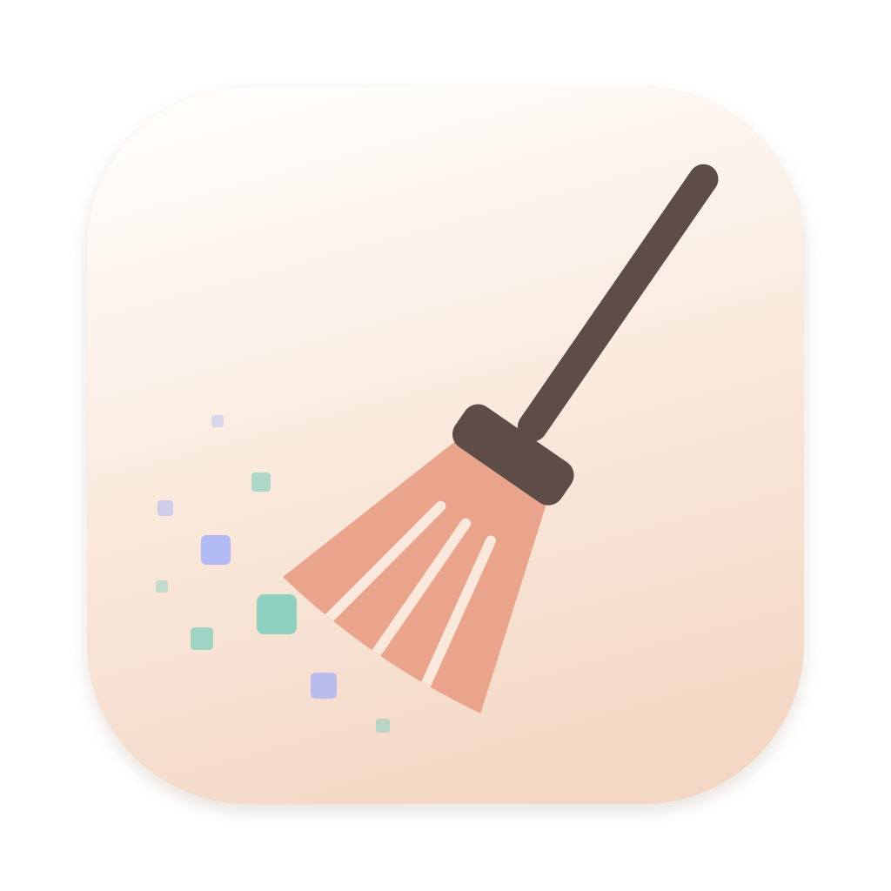
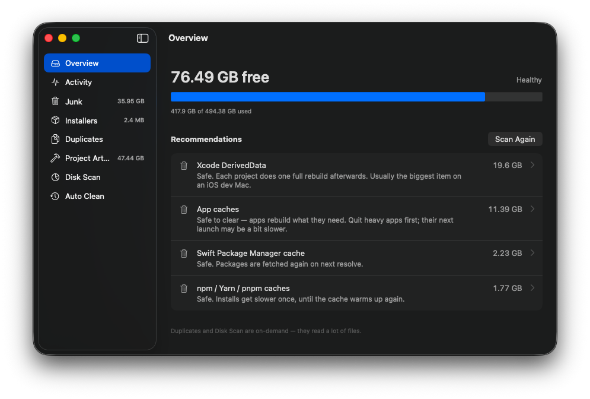
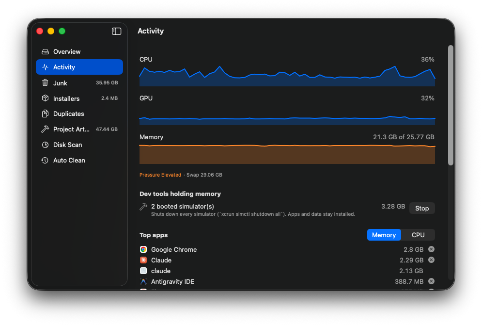
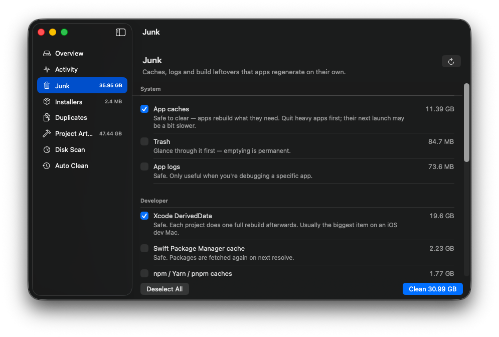
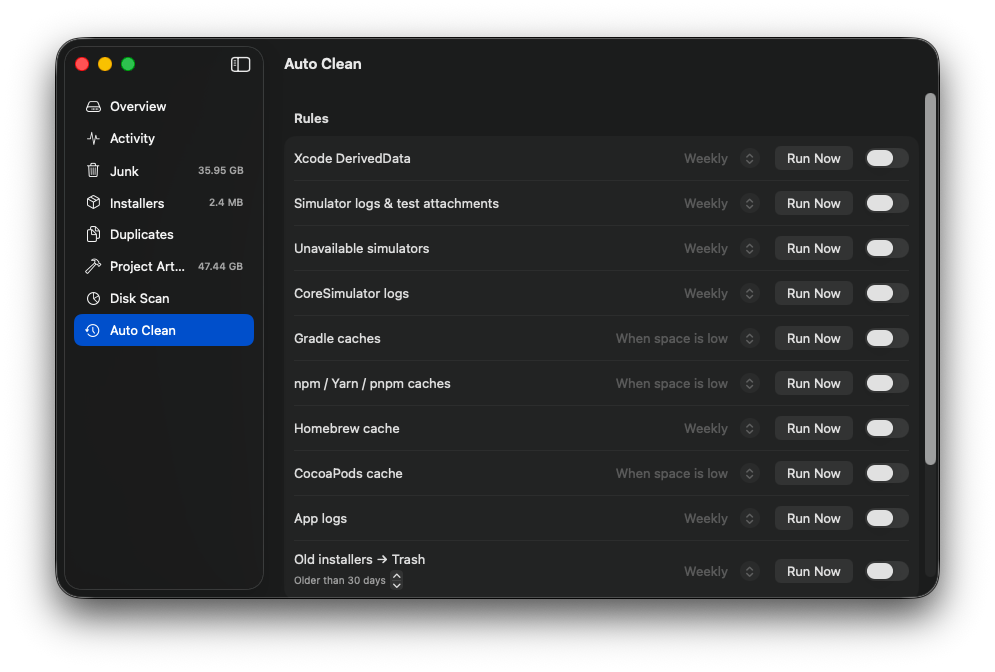
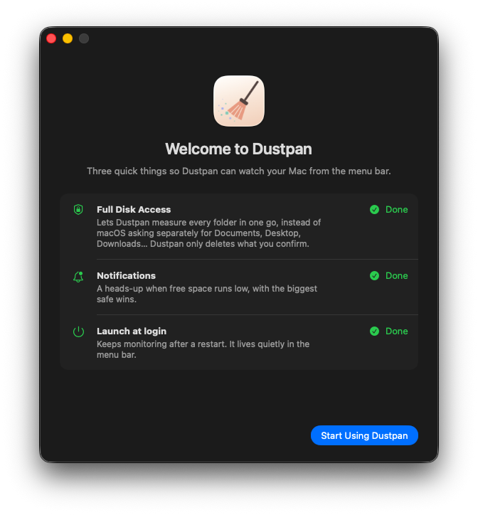

<p align="center"></p>

# Dustpan

[](https://github.com/GabriPalmyro/dustpan/actions/workflows/build.yml)

A small, native macOS menu bar app that keeps an eye on your disk, memory, CPU and GPU — and tells you exactly what's safe to clean, and why.

Built for developer Macs, where the space usually goes to Xcode, simulators, Gradle and `node_modules` — not to your photos.

- **SwiftUI only**, no dependencies
- **Explains before it deletes** — every item says what it is and what happens if it's removed
- **Nothing automatic until you turn it on**
- Open source, MIT

<p align="center"></p>

<table>
  <tr>
    <td></td>
    <td></td>
  </tr>
  <tr>
    <td align="center"><b>Activity</b> — CPU, GPU, memory pressure and swap, what's using them</td>
    <td align="center"><b>Junk</b> — every item says what it is and what deleting it costs</td>
  </tr>
  <tr>
    <td></td>
    <td></td>
  </tr>
  <tr>
    <td align="center"><b>Auto Clean</b> — opt-in rules: daily, weekly or when space is low</td>
    <td align="center"><b>Onboarding</b> — one checklist for the permissions it needs</td>
  </tr>
</table>

## What it does

| | |
|---|---|
| **Menu bar** | CPU, GPU and memory meters, memory pressure and swap, the apps using the most memory (quit with one click), free disk space and the single biggest win. Optionally shows `CPU 23% MEM 71%` or free space right in the menu bar. |
| **Notifications** | Warns when free space drops below your threshold (default 20 GB), listing the biggest safe wins. At most every 6 h (3 h when critical). |
| **Activity** | Live CPU / GPU / memory charts, top apps by memory or CPU with helpers rolled into their app (Chrome's 40 helpers count as Chrome), and dev tools quietly holding RAM — booted simulators, Gradle/Kotlin daemons — with a Stop button. |
| **Junk** | App caches and logs, Trash, Xcode DerivedData and device support, simulator caches, Gradle, CocoaPods, pub, npm/Yarn/pnpm, Homebrew, SwiftPM, pip. |
| **Simulators** | Logs and XCUITest attachments inside shut-down simulators — often 5–10 GB each — without erasing the simulator or its apps. Removes unavailable simulators. |
| **Review manually** | Things Dustpan measures but won't touch, each with the exact command or place to clean it: Xcode archives, simulators, FVM Flutter SDKs, Dart packages, Android emulators, iPhone backups, Docker, simulator runtimes. |
| **Installers** | `.dmg`, `.pkg`, `.xip`, `.iso`, app builds (`.ipa`, `.apk`, `.aab`) and "Install macOS" apps. Moved to the Trash. |
| **Duplicates** | Identical files in your personal folders (size → first 64 KB → SHA-256). Keeps the oldest copy by default and never lets you mark every copy. |
| **Project artifacts** | `node_modules`, `build`, `Pods`, `.dart_tool`, `.gradle`, `.build`, `.next` inside your projects, with how long each project has been idle (last commit/checkout) and the command that regenerates it. Git worktrees are flagged. |
| **Disk scan** | Where the space actually goes — drill into any folder, see the largest files. |
| **Auto clean** | Opt-in rules per item: daily, weekly, or only when space is low. |

## On "cleaning RAM"

Dustpan doesn't have a "free up memory" button, on purpose. macOS keeps unused RAM busy as cache; a full memory bar is normal and "purging" it just makes things slower. What matters is **memory pressure** — when it turns yellow or red and swap keeps growing, quit the heaviest app. That's what the Activity view is built around.

## Safety

- Caches are emptied in place (the folder stays); user files (installers, duplicates) go to the **Trash**.
- Project artifacts are deleted permanently — trashing a 2 GB `node_modules` frees nothing — after a confirmation.
- A hard-coded guard refuses to delete your home folder, `~/Library`, `~/Documents`, `~/Desktop`, `~/Downloads` and system folders, whatever an item says.
- Booted simulators are never touched.
- Apps are quit politely (like ⌘Q), so they can still ask to save. Only regular apps get a Quit button — never Finder or background processes.

## Install

**[Download the latest Dustpan.dmg](https://github.com/GabriPalmyro/dustpan/releases/latest)**, open it and drag Dustpan to Applications. Requires macOS 14 Sonoma or later (Apple Silicon or Intel).

Dustpan isn't notarized by Apple yet, so macOS blocks the first launch. Either:

- open **System Settings › Privacy & Security**, scroll down and click **Open Anyway** next to Dustpan, or
- run once in Terminal:

  ```bash
  xattr -dr com.apple.quarantine /Applications/Dustpan.app
  ```

After that it lives in your menu bar. Turn on **Launch at login** in Settings (⌘,).

Give Dustpan **Full Disk Access** once (the Overview has a button that opens the right screen). Without it macOS asks separately for Documents, Desktop, Downloads and more, and some folders can't be measured at all.

### Build from source

Requires Xcode 16+.

```bash
git clone https://github.com/GabriPalmyro/dustpan.git
cd dustpan
make install    # builds a universal Dustpan.app and copies it to /Applications
```

## Develop

```bash
make test     # unit tests for the core (scanners, cleaner, rules, system sampler)
make run      # build the .app and open it
make dmg      # build/Dustpan-<version>.dmg
make icon     # redraw Resources/AppIcon.icns from scripts/make-icon.swift
open Package.swift   # work in Xcode
```

```
Sources/
  DustpanCore/   scanners, cleaner, auto-clean rules, system sampler — no UI, fully tested
  Dustpan/       SwiftUI app: menu bar extra, main window, settings
scripts/
  build-app.sh   packages the .app (set SIGN_IDENTITY to sign with Developer ID)
  make-dmg.sh    wraps it in a drag-to-install disk image
  make-icon.swift  draws the app icon in code
```

Adding a cleanup location is one entry in [`JunkCatalog.swift`](Sources/DustpanCore/JunkCatalog.swift): paths, a one-line summary and a tip saying what happens when it's deleted.

## Releases

Every push to `main` builds and tests on GitHub Actions and attaches the DMG to the run. Pushing a tag publishes a release:

```bash
git tag v0.2.0 && git push origin v0.2.0
```

## License

MIT
